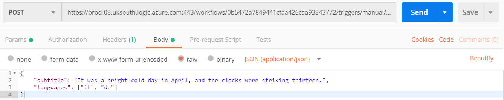
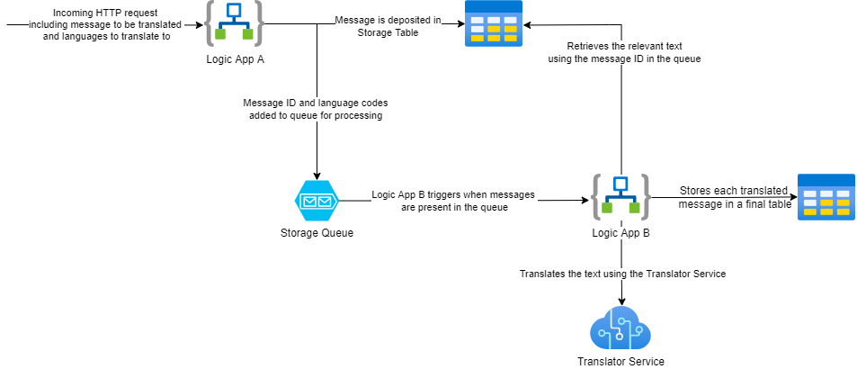

# During the Workshop

Before starting make sure you have addressed the prerequisites in the [README.md](README.md)

AcmeSub are a company who create subtitles for films. They wish to automate the process of  translating their subtitles to the different languages they support. As this processing will take time, they are worried about how well the system will hold up when under heavy load. They have approached you to help them investigate the best infrastructure for this task.

Before you get started, check that you can see your resource groups in the Azure portal [here](https://portal.azure.com/#blade/HubsExtension/BrowseResourceGroups). You may need to switch directory first - click on your name in the top right of the screen, then click on "Switch directory" and select **Softwire Academy**. 

## Part 1 - Load Testing

First of all we will investigate how well an application behaves under load when it is not *elastic* or *scalable*. For this exercise we will use a Python application that has one HTTP endpoint. This endpoint, see [/initialApp/app.py](/initialApp/app.py), will just wait for 5 seconds when it is called, this is to simulate the time it will take to do the actual processing that AcmeSub will require in the future.

  1. Navigate to the application's folder: `cd ./initialApp/`
  2. Install requirements: `pip install -r requirements.txt`
  3. Run the app: `flask run`

We will host this application in a non-scalable way, which we can then perform *load testing* against.
> The ideal demonstration of an outdated, non-scalable deployment would be via VMs, but these cost money, so for the purposes of this exercise we'll be using Azure App Service with scalability turned off, as this is available on the free service plan.

In the same folder as above:
 - Login to the Azure CLI: `az login`
  - If you're using GitPod, you'll need to use `az login --use-device-code`
 - Create a Web App:
 ```
 az webapp up --sku B1 --location uksouth --name <APP_NAME> --resource-group <RG_NAME>
 ```
> `<APP_NAME>` should be replaced with a name that is unique across all of Azure (as this application will be hosted at `<APP_NAME>.azurewebsites.net`). For example you could use your initials plus today's date e.g. `abc-01-01-1900-load-testing`. The tutors should provide you with a resource group to contain your resources for this workshop. Replace `<RG_NAME>` with the name of your resource group ending "\_Workshop".
 - The command should return the URL that the application is now hosted on. If you navigate to that URL in your browser it should take around 5 seconds before it loads with a message.

Now that we have the application running, we're going to use an online service, BlazeMeter, to perform load testing on it. With this tool we can send out a number of requests over a few minutes to see how the application performs.

  1. [Sign up for an account on the free tier of BlazeMeter](https://www.blazemeter.com/pricing/)
  2.  Create a new performance test by clicking 'Create Test' and then 'Performance Test':


  3. Choose 'Enter Url/API Call`

  

  4. Give the request any name you want, and then in the URL enter the URL of your application e.g. `http://abc-01-01-1900-load-testing.azurewebsites.net`

  

  5. Under 'Load Configuration' we can then set how many users will be used in this performance testing (i.e. how many clients will be requesting from the API simultaneously), how long the load test lasts for and how quickly users are added. We want to show how increasing the number of users affects the response time, so choose the following settings:
    - Total Users: 50
    - Duration: 5 minutes
    - Ramp up Time: 4 minutes
    - Ramp up Steps: 10

  

  6. The 'Load Distribution' lets you set where the requests will originate from. This doesn't matter too much to us, so just select one that is in the UK, as that is where our application is hosted.

  

  7. Hit 'Run Test' on the left-hand side.

BlazeMeter will take a couple of minutes to warm up, before it then starts performing the load test on your application. Feel free to start looking at the next part whilst you wait for it to complete.

Once the test has booted up, it will redirect you to a summary screen, where you will be able to see information as the test is carried out, including average response time and number of errors.

When the test has ended you should hopefully see an average response time which is much higher than the 5 second wait that each request should have. This is because the application, on the current infrastructure, can only handle a limited number of requests at a time. Requests are ending up having to wait for the active requests to finish, and some may even be erroring due to them taking too long to respond.

If you go to the 'Timeline Report' tab you can select to see the average response time plotted against the number of users in the test. This should show that the response time got progressively worse as more users were added. Even when the users start to decrease the response time is still high as there is a backlog of requests that the server has to deal with.


## Part 2 - Logic Apps

To try and solve the problems that the application experiences under load we are going to convert our application to one that runs in a Serverless Environment, using Azure Logic Apps.

### Step 1 - Setting up

The first thing to do is to create a Logic App in Azure. Enter your resource group in the Azure Portal, and create a new "Logic App". Choose any appropriate name, assign it to your Workshop resource group and select the "Consumption" instance type, otherwise leave the options to their defaults.

Next, we want to create an app that will be triggered by an HTTP request, so we will use the template 'When a HTTP request is received' trigger.

Use the sample payload below to generate the relevant schema:
```
{
    "subtitle": "It was a bright cold day in April, and the clocks were striking thirteen."
}
```
Add a "Delay" action to run after the trigger has fired, which waits 5 seconds, and then save your Logic App. Test your trigger, both directly through the Azure Portal (the "Run Trigger" button) and through Postman; you can find the HTTP address exposed by clicking on the HTTP trigger after saving your app.



Did you notice anything odd?

The response is coming back much quicker than 5 seconds! The Logic App has determined that since you're not doing anything after the delay, it can respond to your request immediately and process the action asynchronously. In order to better compare with the previous app - add a "Response" action (that can just return a 200 status code) after the delay.

### Step 2 - Load testing Logic App

To test whether moving to a new cloud-based, elastic, serverless environment has improved performance when under load we should repeat the load testing we did with BlazeMeter, but this time using the URL for the Azure Logic App you have just created. When setting the URL, you will also have to remember to pass in the JSON object your request is now expecting.

Hopefully, you should see three things:

- The average response time has been reduced. This is still higher than the 5 seconds that the function itself takes to run, this is due to there being an overhead as more instances of your function gets created, to handle the load.

- The response time does not increase dramatically when more users are added to the load test, as the Logic App is creating more instances of the function to handle the increased demand.

- There should (hopefully) be no errors, as there are no timeouts, as all requests are being handled in a timely manner.

## Part 3 - Integrating with Azure Table Storage

AcmeSub have been in touch, instead of processing the subtitles immediately, they would like us to instead save them to some storage that they can access later.

For the moment we want to just focus on the infrastructure, so we will keep using our app from Part 2, but we will alter it to save the subtitles somewhere.

### Step 1 - Setting up Azure Table Storage

For this exercise, we're going to use Azure Table storage, which is a NoSQL datastore. In order to use Table storage, we'll first need a _Storage Account_: this can be used to store several types of data, as well as to maintain state and other information about your project.

From your local machine, run the following command to create a Storage Account, or create it through the Azure Portal.

```
az storage account create --name <STORAGE_NAME> --location uksouth --resource-group <RG_NAME> --sku Standard_LRS
```
> Replace `<STORAGE_NAME>` with the name you want to give this storage account, this must be unique across the whole of Azure Storage and contain 3 to 24 numbers or lowercase letters. It is worth making a note of this name as you will use it later.

Within the Storage Account, we can now create a Table:

```
az storage table create --name AcmeTranslations --account-name <STORAGE_NAME>
```
> We will use the same Storage Account that we created previously, so replace `<STORAGE_NAME>` with the name you used in Part 2 Step 2.

In the [Azure Portal](https://portal.azure.com/) you should now be able to find your created Table Storage:
- Search for 'Storage accounts' in the top search bar
- Select the storage account you are using for this workshop
- Select 'Storage Explorer'
- You should then be able to expand 'Tables' and select the table you just created
- For now it should show no data

### Step 2 - Binding to Azure Table Storage

We now want to change our app so it saves the subtitle to the Azure Storage table that has just been created. To do this you will need to:

1. Add a new "Table Storage: Insert Entity" action to your app
2. Remove the 5 second delay from your app

For the new Insert Entity step, link it to the table that you just created, and choose any connection name. The Entity you are adding will be a JSON object with the information you want to add; for now we should include the following fields:

- "PartitionKey" as any hard coded string, e.g. "my-key"
- "RowKey" - we want this to be a unique value for every entry, so use the "expression" tab in the Dynamic Content pop-up to set it to the result of `guid()` to use a randomly generated id
- "Name" - we want this to be the text that wants to be translated. Use the Dynamic Content option to grab the subtitle you stated should be received in the HTTP request

> Choosing sensible Partition Keys depends on your domain - we won't worry about them here but if you're interested or using this for a production system then it's [worth reading more about them](https://docs.microsoft.com/en-us/rest/api/storageservices/designing-a-scalable-partitioning-strategy-for-azure-table-storage)

Save your changes, and check that you can use the endpoint to add a new entry to your Table.

## Part 4 - Communicating between apps

AcmeSub need to be able to translate their subtitles into multiple different languages. One way we could architect this is to have our initial app queue up the required translations, which can be handled by another app. 

<details><summary>Take a moment to consider what trade-offs this design choice might have</summary>

Separating the receipt of requests from the translations themselves has several advantages:
* The original app can respond quickly to users
* A backlog of translations won't stop new requests being received
* Retry behaviour for translations can be controlled by our apps, rather than relying on users to retry
* The logic each component is handling is simpler

It also has several potential disadvantages:
* Often produces some extra complexity - e.g. a second logic app!
* Users know their request has been accepted, but we need extra logic for them to find out when it's complete/what the result is

By and large, there's more initial complexity in splitting the stages up, but it can result in a more maintainable and reliable system.
</details>

To help us achieve this we are going to be using Azure Queue storage.

The way we want the application to work is:
1. Logic App _A_ receives an HTTP Request containing the subtitle and the languages to translate the subtitle into.
2. Logic App _A_ saves the subtitle to Azure Table storage.
3. Logic App _A_ sends out a message per language, this message contains the location of the subtitle in Azure Table storage and the language to translate it to.
4. Logic App _B_ reads the queue to get messages from Logic App _A_. It will use the information in the message to retrieve the subtitle from Azure Table Storage.
5. Logic App _B_ will process this subtitle, based on the language contained in the message.
6. Logic App _B_ will save the processed subtitle into a different table in Azure Table storage.



As you can see, our existing App acts very closely to how Logic App _A_ needs to behave, so we will tweak that one and then create a new app for Logic App _B_.

### Step 1 - Setup Azure Queue Storage

Azure Queue Storage lets us add messages to a queue, which can then be read from elsewhere. These messages are stored in an Azure Storage account, so we can use the one we have already setup previously when creating the queue:

```
az storage queue create --name acmesub-translations-queue --account-name <STORAGE_ACCOUNT_NAME>
```
> Where `<STORAGE_ACCOUNT_NAME>` is the name of the storage account you have setup previously.

If you navigate to the _Storage Explorer_ in your Storage Account via the Azure Portal (as you did in Part 3) you should now be able to expand `QUEUES` to see your newly created queue.

### Step 2 - Sending messages

We now want to change our existing app to send messages to the queue. To do so you will need to:

1. Change the JSON that you send and expect to receive in the HTTP request to include the language codes for the subtitle to be translated to. For example:

``` JSON
{
    "subtitle": "It was a bright cold day in April, and the clocks were striking thirteen.",
    "languages": ["it", "de"]
}
```

2. Add a ["For each" action]((https://docs.microsoft.com/en-us/azure/logic-apps/logic-apps-control-flow-loops#foreach-loop)) so that we can iterate over the languages
3. Add an action within the loop to add each translation to the queue. Messages in queue storage can be any string up to 64KB in size, however if we use a JSON format it allows other bindings to read from the message, which will come in useful later. We want the JSON to contain the row key for the subtitle in Azure Table storage, and the language code, e.g.:

``` JSON
{
    "rowKey": "50949d7f-9dcb-4991-8b64-49a8fe002f0b",
    "languageCode": "de"
}
```

> Note that you will need to wrap any dynamic content values in quotes when creating your JSON for the queue in order to ensure they are interpreted as strings

In order to set up the queue action, you will need to specify the name of your storage account & queue, and an access key which you can find within the Azure Portal by visiting the Storage Account and selecting the "Access Keys" option in the side bar.

If you are successful you should be able to see messages being created in the queue in the Azure portal when you send a POST request to the endpoint.

### Step 3 - Receive messages

Next we want to add a new Logic App to your resource group that reads messages off the queue.

1. Create a new Logic App as before that uses a [Queue trigger](https://docs.microsoft.com/en-us/connectors/azurequeues/#triggers) for "When there are messages in a queue". Make sure to set the trigger to look at the correct queue.
  a. By default, the trigger will run the actions for each message individually. You can click into the "Settings" and switch off "Split On" if you want to handle the loop behaviour yourself.
  b. Leave the polling timer at its default, or pick a sensible value.
2. For now, just let the app read each message in the queue and then [delete it](https://docs.microsoft.com/en-us/connectors/azurequeues/#delete-message-(v2)). You should find any values you need available within the relevant queue message being iterated over.

> By default, the connector will hide messages once the logic app is processing them in order to avoid duplicate processing, but they won't be cleared until actively deleted to allow retries on an error.

If you have a look at the queue in the Azure Portal, you should see that the queue has now been cleared, as the items have been processed.

### Step 4 - Retrieve subtitle from Azure Table

We can now add an [Azure Table storage "Get Entity" action](https://docs.microsoft.com/en-gb/connectors/azuretables/#get-entity) to retrieve the subtitle. We can hardcode the Partition Key to match that you inserted, but we'll need to read the Row Key from the queue message. One way is to first [parse the JSON](https://docs.microsoft.com/en-us/azure/logic-apps/logic-apps-perform-data-operations#parse-json-action) in order to make the Row Key and Language Code easily accessible as dynamic content.

Once you think that's ready, add another "Parse JSON" action to interpret the entity you've just read out, and give it a test:
* Add a new item to the queue with a POST request to your original App
* Manually run the second App, or wait for an automatic run
* Check the overview page for the second App and select the latest run; if you click on the last "Parse JSON" step, does the output include the values you just tried to send over?

### Step 5 - Processing and storing output

We now have an app that receives the language code and accesses the subtitle from Table storage. Next we want to process the subtitle and save the output into a different table within Table storage.

1. Create a new table within Azure Table storage.
2. Add an [Azure Table Insert Entity](https://docs.microsoft.com/en-gb/connectors/azuretables/#insert-entity) action and save the processed subtitle, and the language code, to your new table.
3. Process the subtitle, for the moment we won't actually translate the subtitle, instead use the `toUpper()` method on the relevant subtitle string to convert it to uppercase.

> You can apply the function to the text directly within the Entity JSON using the Dynamic Content helper, just add the relevant function from the Expression tab by clicking on it, and then switch to the Dynamic Content tab and select the relevant value. You should end up with something like `function(\<variable\>). Alternatively, you can [initialise and update a variable](https://docs.microsoft.com/en-us/azure/logic-apps/logic-apps-create-variables-store-values) to hold the processed value.

Check that when you POST a new subtitle, it is processed and added to your new table in uppercase.

## Part 5 - Translating using Azure Translator

Now that we have the architecture in place, we're going to do the actual translation, instead of calling `toUpper()`. To do so we're going to use another cloud-based service - Azure Translator.

You'll find there's an [existing connector for Microsoft Translator](https://docs.microsoft.com/en-us/connectors/translatorv2/) that can translate a given string for a given language code - add it and for now leave the Subscription Key blank. Update your logic app to store the translated text in place of the uppercase text. Test that it works!

Without a subscription key we're limited to a throttled connection; if we want to switch to a higher throughput then we'll need to create our own Translator service - add one to your resource group using the "Global" region, and once created update your Translator connection to use a subscription key from your new service.

## Part 6 (Stretch) - Try out facial recognition

Azure's cognitive services offer many other services, including a facial recognition API. We will set up a new Logic App to catch uploaded images & send them to a Face API instance and we'll store the estimated ages of the subjects.

You'll need to consider:
* Where you'll store the images
* How you'll react when a new image is uploaded
* Where you'll store the results

Think about this, and make a plan for how you might approach this. If you're feeling confident; feel free to give this a go without reading the guidance below!

For storage, we can take advantage of our existing Storage Account, or create a fresh one for this application. Either way, add a new "Container" to your Storage Account; this is a good way to store "blob" data like images, audio, or custom document formats like PowerPoint, and is where we'll upload images.

We'll also need to create a new Logic App that can react to images being uploaded to your Container. Add an empty trigger for now that fires when a blob is added or modified.

<details><summary> Hint </summary>

You may need to create a blank app to start with, and search to find less common triggers, rather than selecting from the preset options.
</details>

Next we need to configure the Face API so that we can use it; deploy a Face API instance to your resource group, and make a note of the access keys and endpoint attached to that resource.

Add a new stage to your Logic App that detects faces in the uploaded image, and configure your connection settings using the details from your Face API instance.

<details> <summary> Hint </summary>

Your "Image URL" structure can be determined by uploading an image to the container, and checking it's URL. You can always try hardcoding the URL to that specific image to start with, and then try using the Dynamic Content to build the URL depending on the uploaded image.

<details> <summary> Example Image URL structure: </summary>

https://<your_storage_account_name>.blob.core.windows.net@{triggerBody()?['Path']}
</details>
</details>

Finally, we should do something with this information! For now, we'll just store that information in our table storage. Add a new Table to your Storage Account called "FaceInformation", and update your Logic App to add an entry to that table for each face recognised including:
* The image name
* The estimated age of the identified subject

Try out your application - upload some photos with & without people in, and see how well it handles it. Do you agree with its assessments?

# At The End Of The Workshop

It is important to clean up the resources you have been using in the cloud when you have finished using them, to ensure we're not having to unnecessarily pay for them.

You can delete the resources you created for Parts 1-5 via the portal - navigate to your resource group and delete each resource via its corresponding `...` options menu or follow the [Azure guide to deleting resources via the portal](https://docs.microsoft.com/en-us/azure/azure-resource-manager/management/manage-resources-portal#delete-resources).
