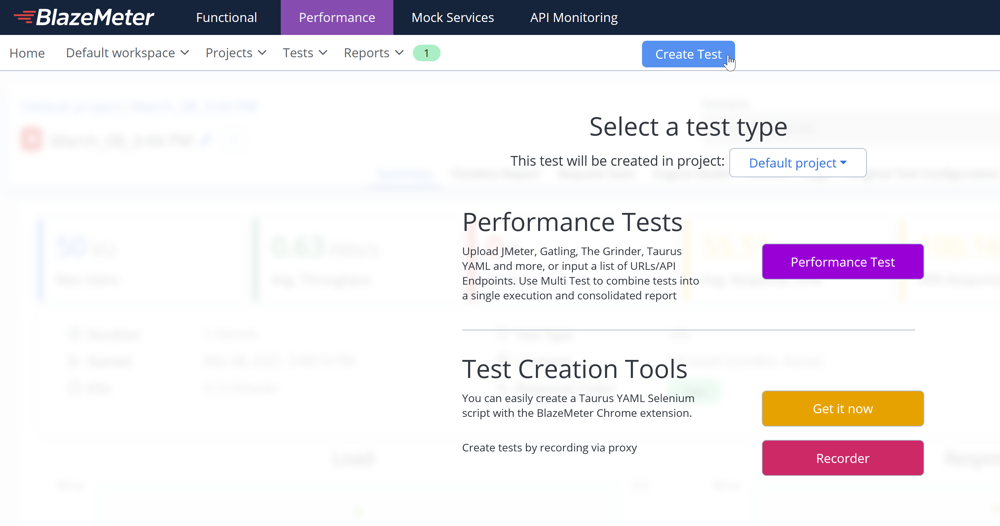
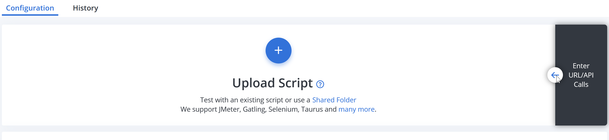
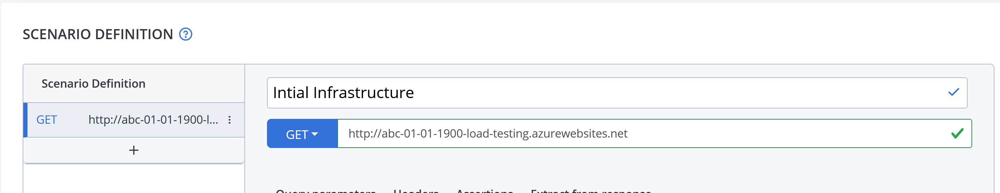
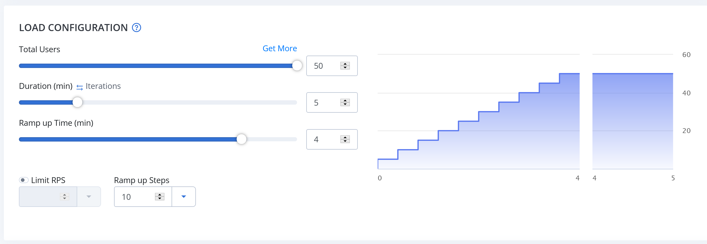
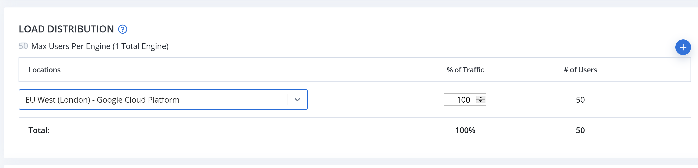
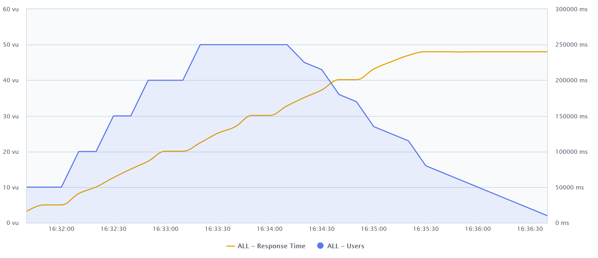
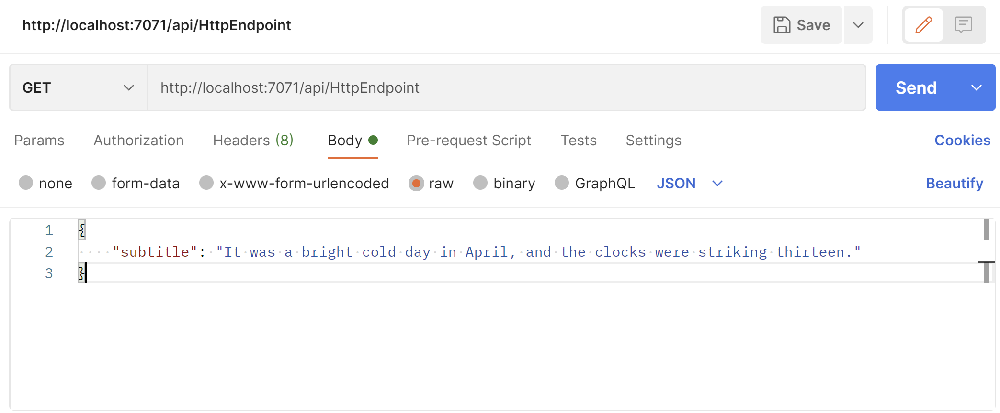

# During the Workshop

Before starting make sure you have addressed the prerequisites in the [README.md](README.md)

AcmeSub are a company who create subtitles for films. They wish to automate the process of  translating their subtitles to the different languages they support. As this processing will take time, they are worried about how well the system will hold up when under heavy load. They have approached you to help them investigate the best infrastructure for this task.

Before you get started, check that you can see your resource groups in the Azure portal [here](https://portal.azure.com/#blade/HubsExtension/BrowseResourceGroups). You may need to switch directory first - click on your name in the top right of the screen, then click on "Switch directory" and select **Softwire Academy**. 

## Part 1 - Load Testing

First of all we will investigate how well an application behaves under load when it is not *elastic* or *scalable*. For this exercise we will use a Python application that has one HTTP endpoint. This endpoint, see [/initialApp/app.py](/initialApp/app.py), will just wait for 5 seconds when it is called, this is to simulate the time it will take to do the actual processing that AcmeSub will require in the future.

  1. Navigate to the application's folder: `cd ./initialApp/` 
  2. Install requirements: `pip install -r requirements.txt`
  3. Run the app: `flask run`

We will host this application in a non-scalable way, which we can then perform *load testing* against.
> The ideal demonstration of an outdated, non-scalable deployment would be via VMs, but these cost money, so for the purposes of this exercise we'll be using Azure App Service with scalability turned off, as this is available on the free service plan.

In the same folder as above:
 - Login to the Azure CLI: `az login`
 - Create a Web App:
 ```
 az webapp up --sku B1 --location uksouth --name <APP_NAME> --resource-group <RG_NAME>
 ```
> `<APP_NAME>` should be replaced with a name that is unique across all of Azure (as this application will be hosted at `<APP_NAME>.azurewebsites.net`). For example you could use your initials plus today's date e.g. `abc-01-01-1900-load-testing`. The tutors should provide you with a resource group to contain your resources for this workshop. Replace `<RG_NAME>` with the name of your resource group ending "\_Workshop".
 - The command should return the URL that the application is now hosted on. If you navigate to that URL in your browser it should take around 5 seconds before it loads with a message.

Now that we have the application running, we're going to use an online service, BlazeMeter, to perform load testing on it. With this tool we can send out a number of requests over a few minutes to see how the application performs.

  1. [Sign up for an account on the free tier of BlazeMeter](https://www.blazemeter.com/pricing/)
  2.  Create a new performance test by clicking 'Create Test' and then 'Performance Test':


  3. Choose 'Enter Url/API Call`

  

  4. Give the request any name you want, and then in the URL enter the URL of your application e.g. `http://abc-01-01-1900-load-testing.azurewebsites.net`

  

  5. Under 'Load Configuration' we can then set how many users will be used in this performance testing (i.e. how many clients will be requesting from the API simultaneously), how long the load test lasts for and how quickly users are added. We want to show how increasing the number of users affects the response time, so choose the following settings:
    - Total Users: 50
    - Duration: 5 minutes
    - Ramp up Time: 4 minutes
    - Ramp up Steps: 10

   

  6. The 'Load Distribution' lets you set where the requests will originate from. This doesn't matter too much to us, so just select one that is in the UK, as that is where our application is hosted.

   

  7. Hit 'Run Test' on the left-hand side.

BlazeMeter will take a couple of minutes to warm up, before it then starts performing the load test on your application. Feel free to start looking at the next part whilst you wait for it to complete.

Once the test has booted up, it will redirect you to a summary screen, where you will be able to see information as the test is carried out, including average response time and number of errors.

When the test has ended you should hopefully see an average response time which is much higher than the 5 second wait that each request should have. This is because the application, on the current infrastructure, can only handle a limited number of requests at a time. Requests are ending up having to wait for the active requests to finish, and some may even be erroring due to them taking too long to respond.

If you go to the 'Timeline Report' tab you can select to see the average response time plotted against the number of users in the test. This should show that the response time got progressively worse as more users were added. Even when the users start to decrease the response time is still high as there is a backlog of requests that the server has to deal with.

 

## Part 2 - Azure Functions

To try and solve the problems that the application experiences under load we are going to convert our application to one that runs in a Serverless Environment, using Azure Functions.

### Step 1 - Running Locally

The first thing to do is to create a local function project. In Azure Functions, a function project is a container for one or more individual functions. To do this we will use Azure Functions Core Tools, that you installed in the prerequisites to this workshop.
Run the following command from **the root of this repository, not inside `initialApp/`.**

```
func init AcmeSubProject --python
```

This will create a new folder called `AcmeSubProject`, which you will want to navigate into.

```
cd AcmeSubProject
```

Next, we want to create a function that will be triggered by an HTTP request, so we will use the 'HTTP trigger' template.

```
func new --name HttpEndpoint --template "HTTP trigger" --authlevel "anonymous"
```

This creates a new subfolder, containing the code for this function:

#### function.json

``` JSON
{
  "scriptFile": "__init__.py",
  "bindings": [
    {
      "authLevel": "Anonymous",
      "type": "httpTrigger",
      "direction": "in",
      "name": "req",
      "methods": [
        "get",
        "post"
      ]
    },
    {
      "type": "http",
      "direction": "out",
      "name": "$return"
    }
  ]
}
```

This is a configuration file that defines the *trigger* and *bindings* for the function.

*Triggers* are what causes a function to run, like an HTTP Request or a Timer. They have associated data, that can be passed into the function as a parameter. In the above instance the HTTP Trigger passes in its data as a parameter named `req`. Every Azure Function has exactly one trigger, with a trigger effectively being a special sort of *input binding*.

 A *binding* is how a function is connected to another resource and they can be either an *input binding* or an *output binding*. Input bindings receive data from a data source and pass it into the function as parameters. Output bindings take data from the function and send it to another resource, for example returning an HTTP response or creating a message in a Message Queue.

 Bindings prevent you from needing to hardcode access to other services within the function itself, they are declared in this JSON file. A function can have zero or many input and/or output bindings.

 The `scriptFile` property declares the name of the function that will be run.

 #### \_\_init\_\_.py

``` Python
import logging

import azure.functions as func


def main(req: func.HttpRequest) -> func.HttpResponse:
    logging.info('Python HTTP trigger function processed a request.')

    name = req.params.get('name')
    if not name:
        try:
            req_body = req.get_json()
        except ValueError:
            pass
        else:
            name = req_body.get('name')

    if name:
        return func.HttpResponse(f"Hello, {name}. This HTTP triggered function executed successfully.")
    else:
        return func.HttpResponse(
             "This HTTP triggered function executed successfully. Pass a name in the query string or in the request body for a personalized response.",
             status_code=200
        )

```

\_\_init\_\_.py contains a `main()` Python function, which is called when the function is triggered. It takes an HTTP Request as the parameter `req` and returns an HTTP Response, as per the configuration in *function.json*.

Before we worry about hosting the function on Azure itself we are going to test that in runs locally.

- Make sure you're in the root directory of the local function project (`AcmeSubProject`)
- Run command:  `func start`
> Note that the Azure Functions tools are only compatible with the 64-bit version of Python. If you see this error `ImportError: cannot import name 'cygrpc'`, you are using a 32-bit version.
> If you face an issue with `func start` hanging, try running `func start --verbose` for more info. You may find removing the `extensionBundle` section of your `host.json` file fixes it. 
- Towards the end of the output it should give you a URL. Copy this into a browser and append the query string `?name=<YOUR_NAME>` (so the full URL looks something like `http://localhost:7071/api/HttpEndpoint?name=Alice`)
- You should hopefully see a message returned from the function

> You can debug an Azure function locally by using the Azure Functions extension to generate the correct launch config. If you install it, it should detect the Function when you open the project and a prompt will appear to set up initial config. [See here](https://docs.microsoft.com/en-us/azure/azure-functions/functions-develop-vs-code?tabs=python) for details of developing Functions with the extension.

Now that we have it running locally, we want to replace the code in the default function with something similar to the dummy code that we are using in our existing application. However, we will change it so we can send the text that we want to translate to it. Change \_\_init\_\_.py to look like the following:

``` Python
import logging
import time
import azure.functions as func


def main(req: func.HttpRequest) -> func.HttpResponse:
    logging.info('HTTP trigger function received a request.')
    start = time.time()

    req_body = req.get_json()
    subtitle = req_body.get("subtitle")

    time.sleep(5) # Simulating 5 seconds of cpu-intensive processing
    end = time.time()
    processingTime = end - start

    return func.HttpResponse(
        f"Processing took {str(processingTime)} seconds. Translation is: {subtitle}",
        status_code=200
    )

```

Once you've updated the code, you can run `func start` again to run the new version.

The function now expects us to send a JSON object to it containing the subtitle to translate, so instead of using the browser to test it, we will use Postman. Open up Postman and select to create a new request (File > New...). 
- Set the URL to the URL returned by `func start` command
- Under the 'Body' tab, select 'raw' and change the 'Text' dropdown to read 'JSON'
- In the textbox input the following JSON:
```
{
    "subtitle": "It was a bright cold day in April, and the clocks were striking thirteen."
}
```
- Hit 'Send'


 

Take a moment to customise the "httpTrigger" binding a little.
- We don't want to accept GET requests, so remove that from the list of accepted methods in `function.json`.
- Rename the binding from "req" to "request". This means updating the "name" property for that binding in `function.json` as well as the corresponding function parameter in `__init__.py`. Each binding in `function.json` needs a corresponding parameter in the `main` function in `__init__.py`, except one output binding can use `main`'s return value instead, if it has name equal to "$return".
 
### Step 2 - Hosting on Azure

> _**Please delete your app service and app service plan from Part 1 before following these instructions. If you don't, you may see an error when running `az functionapp create` below)**_
> [Microsoft's explanation is here](https://github.com/Azure/Azure-Functions/wiki/Creating-Function-Apps-in-an-existing-Resource-Group)

Now that you've got your function working locally we're going to get it running on Azure.

Before the code can be deployed we need to create two more resources in Azure, using the Azure CLI:

- A _Storage Account_: This is used to store the code for your functions, as well as to maintain state and other information about your project.

```
az storage account create --name <STORAGE_NAME> --location uksouth --resource-group <RG_NAME> --sku Standard_LRS
```
> Replace `<STORAGE_NAME>` with the name you want to give this storage account, this must be unique across the whole of Azure Storage and contain 3 to 24 numbers or lowercase letters. It is worth making a note of this name as you will use it later.

- A _Function App_: This is the container for your function code within Azure, it can be thought of the Azure equivalent to your local function project.

```
az functionapp create --resource-group <RG_NAME> --consumption-plan-location uksouth --runtime python --runtime-version 3.8 --functions-version 3 --name <APP_NAME> --storage-account <STORAGE_NAME> --os-type linux
```

> `<STORAGE_NAME>` should be the name of the Storage Account you just created. Replace `<APP_NAME>` with a name that is unique across all of Azure (as this application will be hosted at `<APP_NAME>.azurewebsites.net`). For example you could use your initials plus today's date e.g. `abc-01-01-1900-functions`. It must also differ from the app name you used in Part 1. If you get a "usage error", check that the directory you are in (or any parent directory) doesn't already contain a `.azure/config` file.

Now that we have all the resources that we need, we can deploy to Azure.

```
func azure functionapp publish <APP_NAME>
```
> Replace `<APP_NAME>` with the name you chose above for your Function App. Make sure you're in the root directory of the local function project (`AcmeSubProject`) when running the above command

As when running locally, the command should output a URL. You can use this URL in Postman to send a request to the function (don't forget to send the JSON object, as before!).

Now that you have your Azure Function setup, you can have a look at the resources you have created in the Azure Portal by selecting your resource group.

### Step 3 - Load testing Azure Function

To test whether moving to a new cloud-based, elastic, serverless environment has improved performance when under load we should repeat the load testing we did with BlazeMeter, but this time using the URL for the Azure Function app you have just created. When setting the URL, you will also have to remember to pass in the JSON object your request is now expecting.

Hopefully, you should see three things:

- The average response time has been reduced. This is still higher than the 5 seconds that the function itself takes to run, this is due to there being an overhead as more instances of your function gets created, to handle the load.

- The response time does not increase dramatically when more users are added to the load test, as the Azure Functions is creating more instances of the function to handle the increased demand.

- There should (hopefully) be no errors, as there are no timeouts, as all requests are being handled in a timely manner.

## Part 3 - Integrating with Azure Table Storage

AcmeSub have been in touch, instead of processing the subtitles immediately, they would like us to instead save them to some storage that they can access later.

For the moment we want to just focus on the infrastructure, so we will keep using our function from Part 2, but we will alter it to save the subtitles somewhere.

### Step 1 - Setting up Azure Table Storage

For this exercise, we're going to use Azure Table storage, which is a NoSQL datastore.

```
az storage table create --name AcmeTranslations --account-name <STORAGE_NAME>
```
> We will use the same Storage Account that we created previously, so replace `<STORAGE_NAME>` with the name you used in Part 2 Step 2.

In the [Azure Portal](https://portal.azure.com/) you should now be able to find your created Table Storage:
- Search for 'Storage accounts' in the top search bar
- Select the storage account you are using for this workshop
- Select 'Storage Explorer'
- You should then be able to expand 'Tables' and select the table you just created
- For now it should show no data

### Step 2 - Binding to Azure Table Storage

We now want to change our function so it saves the subtitle to the Azure Storage table that has just been created. To do this you will need to:

1. Add a new binding definition to the _function.json_ file.
2. Change your Python function to use the new binding.
3. You can remove the `time.sleep(5)` line from your Python function at this point

It is worth checking out the [Table Storage output binding documentation](https://docs.microsoft.com/en-gb/azure/azure-functions/functions-bindings-storage-table-output?tabs=python) to help you achieve this task.

> As you are using the same Storage Account for your Azure Table Storage and for your Azure Functions App you do not need to set the `connection` property for the binding in _function.json_ as it will default to use the correct connection. 

To run the function locally you will need to run the command `func azure functionapp fetch-app-settings <app_name>` to provide your local instance with the correct connection details.

Run the function locally with `func start` before trying to publish it. This way you get faster feedback and can see error messages in your terminal. Once you are happy it works you can publish it.

You can check whether you have been successful by using the Azure Portal to see if your function is adding data to the Azure Table.

## Part 4 - Communicating between functions

AcmeSub need to be able to translate their subtitles into multiple different languages. One way we could architect this is to have our initial function queue up a function instance per language to do the translation. To help us achieve this we are going to be using Azure Queue storage.

The way we want the application to work is:
1. Azure Function _A_ receives an HTTP Request containing the subtitle and the languages to translate the subtitle into.
2. Function _A_ saves the subtitle to Azure Table storage
3. Function _A_ sends out a message per language, this message contains the location of the subtitle in Azure Table storage and the language to translate it to.
4. Function _B_ reads the queue to get messages from Function A. It will use the information in the message to retrieve the subtitle from Azure Table Storage.
5. Function _B_ will process this subtitle, based on the language contained in the message.
6. Function _B_ will save the processed subtitle into a different table in Azure Table storage.

As you can see, our existing Azure Function acts very closely to how Function _A_ needs to behave, so we will tweak that one and then create a new function for Function _B_.

### Step 1 - Setup Azure Queue Storage

Azure Queue Storage lets us add messages to a queue, which can then be read from elsewhere. These messages are stored in an Azure Storage account, so we can use the one we have already setup previously when creating the queue:

```
az storage queue create --name acmesub-translations-queue --account-name <STORAGE_ACCOUNT_NAME>
```
> Where `<STORAGE_ACCOUNT_NAME>` is the name of the storage account you have setup previously.

If you navigate to the _Storage Explorer_ in your Storage Account via the Azure Portal (as you did in Part 3) you should now be able to expand `QUEUES` to see your newly created queue.

### Step 2 - Sending messages

We now want to change our existing _HttpEndpoint_ function to send messages to the queue. To do so you will need to:

1. Change the JSON that you send in the HTTP request to include the language codes for the subtitle to be translated to. For example:

``` JSON
{
    "subtitle": "It was a bright cold day in April, and the clocks were striking thirteen.",
    "languages": ["it", "de"]
}
```

2. Add a Queue storage output binding.
3. Using the binding, create a message per language. Messages in queue storage can be any string up to 64KB in size, however if we use a JSON format it allows other bindings to read from the message, which will come in useful later. We want the JSON to contain the row key for the subtitle in Azure Table storage, and the language code, e.g.:

``` JSON
{
    "rowKey": "50949d7f-9dcb-4991-8b64-49a8fe002f0b",
    "languageCode": "de"
}
```
> To create a JSON string from a Python object you can use [json.dumps](https://docs.python.org/3/library/json.html)

Have a look at the [Queue storage output binding documentation](https://docs.microsoft.com/en-gb/azure/azure-functions/functions-bindings-storage-queue-output?tabs=python) to help you achieve this. Like with the Azure Table binding, you don't need to declare the `connection` property in _function.json_ as it will default to using the correct one, as the queue is setup in the same storage account as the function.

If you are successful you should be able to see messages being created in the queue in the Azure portal.

### Step 3 - Receive messages

Next we want to add a new function to your function project that reads messages off the queue.

1. [Create a new function](https://docs.microsoft.com/en-us/azure/azure-functions/functions-run-local?tabs=windows%2Ccsharp%2Cbash#create-func) that uses a [Queue Storage trigger](https://docs.microsoft.com/en-us/azure/azure-functions/functions-bindings-storage-queue-trigger?tabs=python). Make sure to set the binding to look at the correct queue by changing _function.json_ for the new function.
2. For now you can print the contents of the message received to the logs.

Run your function project locally by running `func start` from the AcmeSubProject folder, not the individual function. It will start both. You should be able to see in the logs your queue items being processed by this new function, once you have sent a request to your HTTP endpoint function.

If you have a look at the queue in the Azure Portal, you should see that the queue has now been cleared, as the items have been processed.

### Step 4 - Retrieve subtitle from Azure Table

We can now add an [Azure Table storage input binding](https://docs.microsoft.com/en-gb/azure/azure-functions/functions-bindings-storage-table-input?tabs=python) to retrieve the subtitle.

> In the binding configuration you can set the `rowKey` property to `"{rowKey}"`. This works because when the payload of your trigger is JSON (in our case this is the message that we created in Queue storage) you can refer to properties of that JSON in other bindings. See [the documentation for more information](https://docs.microsoft.com/en-us/azure/azure-functions/functions-bindings-expressions-patterns#json-payloads).

Log the subtitle you have retrieved from Table Storage to ensure it is working correctly.

### Step 5 - Processing and storing output

We now have a function that receives the language code and accesses the subtitle from Table storage. Next we want to process the subtitle and save the output into a different table within Table storage.

1. Create a new table within Azure Table storage.
2. Process the subtitle, for the moment we won't actually translate the subtitle, instead use the `upper()` method on strings to convert it to uppercase.
3. Add an Azure Table output binding and save the processed subtitle, and the language code, to your new table.


## Part 5 (Optional) - Translating using Azure Translator

Now that we have the architecture in place, we're going to do the actual translation, instead of calling `upper()`. To do so we're going to use another cloud-based service - Azure Translator.

Translator doesn't have any function bindings, so instead you can call the service via REST from within your function.

Have a look at the [documentation](https://docs.microsoft.com/en-us/azure/cognitive-services/translator/quickstart-translator?tabs=python) for how to integrate with Translator.

Make sure the language codes you pass into your function are supported by Translator. You can see a [list of supported languages here.](https://docs.microsoft.com/en-us/azure/cognitive-services/translator/language-support#translate)

## Part 6 (Optional) - Facial Recognition

In this part we're going to create a new application, which will consist of:
- A web app, hosted on Azure App Service, through which images can be uploaded
- Azure Blob Storage, to store the images
- A new Azure Function, which retrieves files from Blob Storage and calls the Azure Face API to perform facial recognition

### Step 1 - Deploy image upload webapp

Follow [this tutorial](https://docs.microsoft.com/en-us/azure/storage/blobs/storage-upload-process-images?tabs=dotnet) to deploy a web app that allows you to upload images to Azure Blob Storage. You only need to complete part one of the tutorial series.

> The web app is written in .NET, but you do not need to have any knowledge of .NET to complete the tutorial.

### Step 2 - Create new Azure Functions app

Create a new Python Azure Function App which contains a [Blob Storage Trigger](https://docs.microsoft.com/en-gb/azure/azure-functions/functions-bindings-storage-blob-trigger?tabs=python) to read in images as an input stream, when they are added to Blob Storage.

At the time of writing Azure does not support having a Linux app and a Windows app in the same resource group ([but this is planned to be fixed very soon](https://docs.microsoft.com/en-us/azure/app-service/overview#limitations)) so you may need a second resource group. Ask a tutor to provide one if they haven't already.

As your blob storage will be in a separate resource group from your function app you cannot rely on the connection to it to be automatically populated in your function app. To allow a connection you need to do the following, once you have created the function app through the CLI:

- [Get the connection string for the Azure Storage Account that contains your images.](https://docs.microsoft.com/en-us/cli/azure/storage/account?view=azure-cli-latest#az_storage_account_show_connection_string)
> It is important to keep your connection string safe, as it can be used to access anything in your storage account. For that reason do not commit it to Git or share it in a publicly accessible place.
- [Add your connection string as an application setting in your function app.](https://docs.microsoft.com/en-us/azure/azure-functions/functions-how-to-use-azure-function-app-settings?tabs=azurecli)
- Download your application settings so when you run your function locally it will have access to the storage account:
```
func azure functionapp fetch-app-settings <FunctionAppName>
```
- Update the `connection` property in your _function.json_ file to reference the name of your app setting that contains your conenction string

### Step 3 - Using the Azure Face API

Now that we have the image as an input stream within our function, we want to send it to the Azure Face API to detect any faces within the image. You can do so by [following this tutorial](https://docs.microsoft.com/en-gb/azure/cognitive-services/face/quickstarts/client-libraries?tabs=visual-studio&pivots=programming-language-python), with a couple of changes:

- Use your Python Azure Function, instead of creating a new Python application.
- Instead of calling `face_client.face.detect_with_url`, you can use [`face_client.face.detect_with_stream`](https://docs.microsoft.com/en-gb/azure/cognitive-services/face/quickstarts/client-libraries?tabs=visual-studio&pivots=programming-language-python), as you have the stream from Blob Storage.


# At The End Of The Workshop

It is important to clean up the resources you have been using in the cloud when you have finished using them, to ensure we're not having to unnecessarily pay for them.

You can delete the resources you created for Parts 1-5, and any resource group created for Part 6, via the portal - navigate to your resource group and delete each resource via its corresponding `...` options menu or follow the [Azure guide to deleting resources via the portal](https://docs.microsoft.com/en-us/azure/azure-resource-manager/management/manage-resources-portal#delete-resources).
